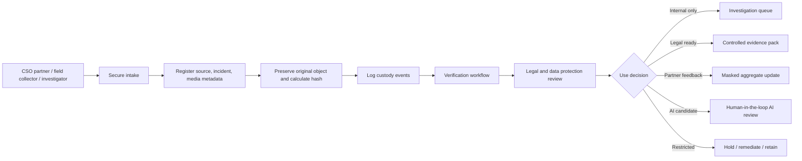
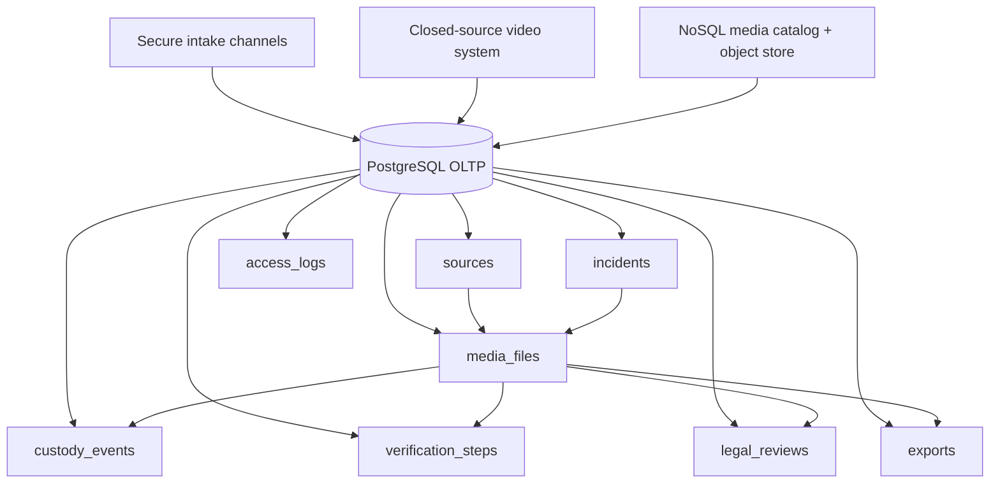
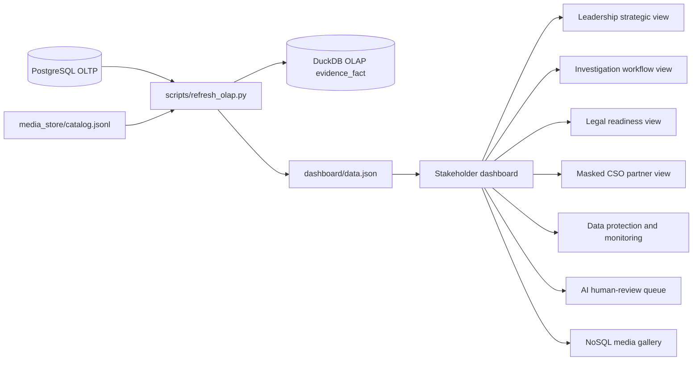
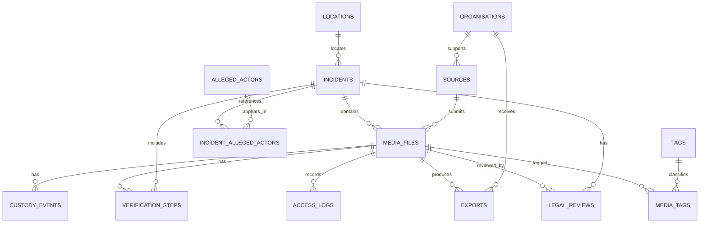

# Architecture and Business Case

## Business Case

Videre-style investigative teams need to receive high-risk multimedia, preserve its integrity, make it searchable, verify it responsibly, and package it safely for internal, legal, advocacy, partner, and AI-assisted workflows.

The system demonstrates a Database Manager approach that separates operational evidence handling from analytics:

- **PostgreSQL OLTP** protects the operational record: source, incident, media metadata, custody, verification, legal status, access classification, and retention.
- **NoSQL media catalog/object store** tracks media objects, previews, hashes, MIME decisions, safety status, and quarantine paths.
- **DuckDB OLAP** provides a rebuildable analytics layer for dashboards without putting pressure on the operational evidence database.
- **Dashboard** presents stakeholder-specific views: executives see concise strategic metrics, operators get filters and workflow queues, legal teams get precise readiness actions, partners see masked aggregates, data protection sees alerts, and AI reviewers see human-in-the-loop queues.

## What Is Achieved

| Capability | Achieved in demo | Value |
| --- | --- | --- |
| Secure intake model | Continuous simulated video/photo/document intake into PostgreSQL | Shows how fresh submissions are registered and governed |
| Evidence integrity | SHA-256 hashes, custody events, metadata fields, source links | Supports traceability and defensibility |
| OLTP/OLAP separation | PostgreSQL for operations, DuckDB for reporting | Protects evidence workflows from dashboard workload |
| NoSQL media model | JSONL document catalog plus object-store folders | Demonstrates scalable media-object handling without storing binaries in relational tables |
| Stakeholder dashboards | Separate views for leadership, investigations, legal, CSO partners, data protection, AI, media, monitoring | Matches decision needs and cognitive load |
| AI governance | AI review queue with human-review controls | Shows safe innovation without automated evidentiary conclusions |
| Monitoring | Custody gaps, restricted concentration, unverified backlog, source skew, ETL duration | Tracks system and evidentiary health |

## Areas for Improvement

| Area | Current demo | Production improvement |
| --- | --- | --- |
| Authentication | Simulated stakeholder selector | Real SSO, MFA, RBAC, session management |
| Row-level security | UI-level separation only | PostgreSQL RLS policies and server-side authorization |
| Media storage | Local synthetic object store | Encrypted S3/Azure Blob/object store with lifecycle policy |
| Malware scanning | Extension/MIME/hash checks | Antivirus, file magic, sandboxing, quarantine workflow |
| ETL | Full refresh into DuckDB | CDC, incremental loads, orchestration, data quality gates |
| Monitoring | Dashboard-level metrics | Prometheus/Grafana, SIEM, audit anomaly detection |
| AI | Recommendation queue only | Approved private/local model pipeline with DPIA and audit logs |
| Legal workflow | Readiness status and next action | Calendar/deadline management, evidence-pack generation, approval workflow |

## Business Workflow



## OLTP Architecture



## OLAP and Dashboard Architecture



## Schema Overview



## diagrams.net / draw.io

Open diagrams.net, choose **File -> Import From -> Device**, then select:

```text
diagrams/videre_architecture.drawio
```

For Mermaid-capable tools, use:

```text
diagrams/videre_schema_erd.mmd
diagrams/videre_oltp_olap_architecture.mmd
```

## Database Manager Interview Framing

> My architecture keeps operational evidence handling separate from reporting and AI-assisted triage. PostgreSQL protects the authoritative evidence metadata and custody trail. The NoSQL/object-store layer handles media objects safely. DuckDB provides a rebuildable analytics layer for stakeholder dashboards. This gives teams practical visibility while protecting evidence integrity, source safety, and legal defensibility.

