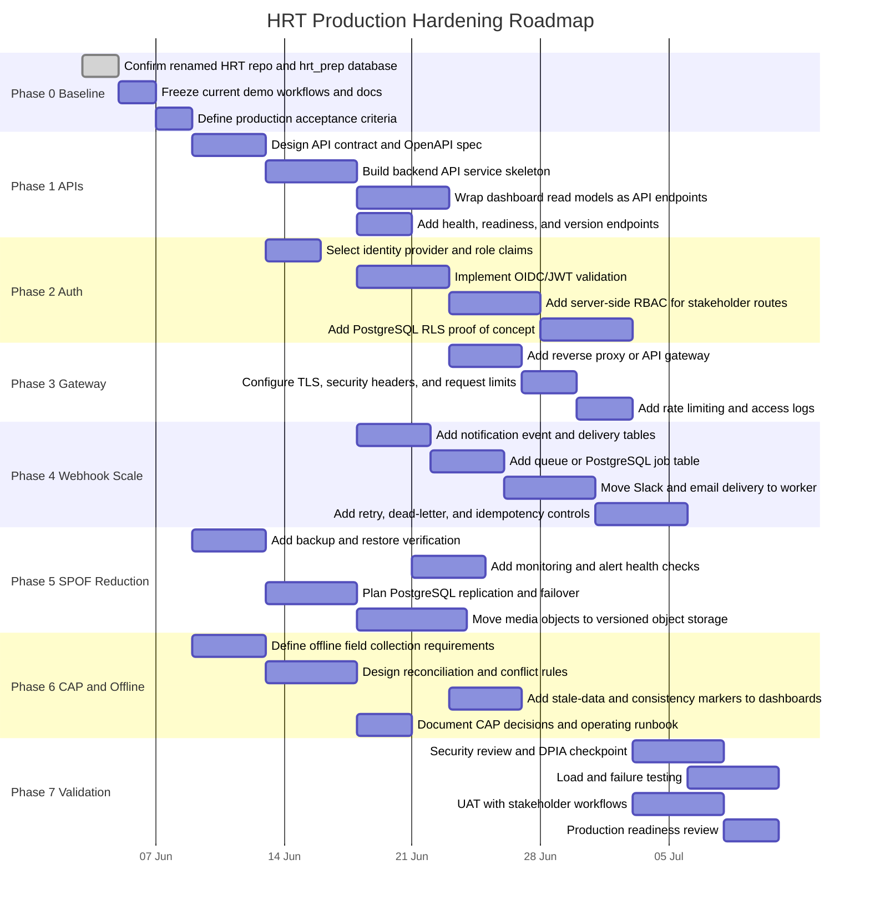

# Implementation Roadmap

This roadmap turns the architecture gap assessment into an implementation workflow. It keeps the current documentation intact and proposes the lowest-friction path from the demo to a production-shaped platform.

## Least-Headwind Path

The least-headwind path is to avoid rebuilding everything at once. Keep the existing PostgreSQL schema, anomaly logic, dashboard views, and Slack/email notifications, then wrap them with production controls in layers.

Recommended order:

1. Stabilise the current demo as a baseline.
2. Add backend APIs around existing scripts and read models.
3. Add real authentication and server-side authorization.
4. Put the API/dashboard behind a reverse proxy or API gateway.
5. Move notification delivery into a queue/worker pattern.
6. Add high availability, backups, monitoring, and disaster recovery.
7. Formalise offline/CAP tradeoffs for field collection.

This path avoids the biggest headwinds:

- It does not require replacing PostgreSQL.
- It does not require rewriting the dashboard first.
- It keeps the evidence data model stable.
- It turns working scripts into services incrementally.
- It separates security hardening from visual redesign.
- It lets alerting mature from synchronous delivery to queued delivery without losing the existing Slack/Gmail integration.

## Target Production Shape

```text
Field / partner / evidence systems
        |
        v
API Gateway / Reverse Proxy
        |
        v
Backend API Service -----> Object / media store
        |
        v
PostgreSQL OLTP
        |
        +----> Notification event table ----> Queue ----> Notification workers ----> Slack / Email
        |
        +----> Reporting refresh / CDC
                          |
                          v
                    OLAP / reporting store
                          |
                          v
                Dashboard API / read models
                          |
                          v
                  Stakeholder dashboard
```

## Dependency Map

```text
Baseline cleanup
  -> API service
      -> JWT / RBAC
          -> API gateway / reverse proxy
              -> production dashboard access

Baseline cleanup
  -> notification event tables
      -> queue
          -> notification workers
              -> retry / dead-letter / audit

Baseline cleanup
  -> backup and restore checks
      -> HA database plan
          -> DR runbook

API service + JWT / RBAC
  -> PostgreSQL RLS
      -> partner-safe external views

Field workflow design
  -> offline intake package
      -> reconciliation rules
          -> CAP tradeoff documentation
```

## Gantt Plan



## Work Packages

| Phase | Work package | Depends on | Output |
|---|---|---|---|
| 0 | Baseline freeze | Current HRT repo | Stable demo, acceptance criteria, risk register |
| 1 | API service | Baseline freeze | API contract, backend service, health endpoints |
| 2 | JWT and RBAC | API service skeleton | OIDC/JWT validation, role claims, protected routes |
| 3 | API gateway/proxy | JWT direction | TLS, routing, rate limits, logs, request limits |
| 4 | Webhook scalability | API service skeleton | Notification event table, queue, worker, retries |
| 5 | SPOF reduction | Baseline freeze | Backups, restore tests, HA plan, media storage plan |
| 6 | CAP/offline design | Field workflow requirements | Offline intake and reconciliation rules |
| 7 | Validation | Auth, gateway, queues | Security review, UAT, load tests, production readiness |

## Phase Details

### Phase 0: Baseline Freeze

Goal:

- Preserve what already works.
- Avoid changing architecture while requirements are still being clarified.

Tasks:

- Confirm `hrt_prep` database setup.
- Confirm dashboard active URL.
- Confirm Slack and Gmail alert behavior.
- Record current known limitations from `architecture_gap_assessment.md`.
- Define acceptance criteria for each production layer.

Exit criteria:

- Demo runs locally.
- README and runbook are current.
- No old customer name remains.
- Architecture gaps are documented.

### Phase 1: APIs

Goal:

- Move from script/static JSON access to service endpoints.

Lowest-friction implementation:

- Start with a small FastAPI or Flask service.
- Keep `scripts/refresh_olap.py` logic callable from the API layer.
- Serve dashboard read models from generated JSON first.
- Move to direct database-backed endpoints later.

Suggested endpoints:

| Endpoint | Purpose |
|---|---|
| `GET /api/health` | Service health |
| `GET /api/dashboard/{role}` | Stakeholder dashboard data |
| `GET /api/anomalies` | AI anomaly list |
| `GET /api/notifications` | Notification delivery status |
| `POST /api/refresh` | Trigger reporting refresh in controlled environments |
| `POST /api/intake/media` | Future intake endpoint |

Exit criteria:

- Dashboard can read from API instead of directly from `dashboard/data.json`.
- Health endpoint confirms service readiness.
- API responses are role-filtered.

### Phase 2: JWT and RBAC

Goal:

- Replace simulated login with real authentication.

Lowest-friction implementation:

- Use a known OIDC provider rather than building auth directly.
- Validate JWTs server-side in the API.
- Keep frontend role selector only for local demo mode.

Role model:

| Role | Data access |
|---|---|
| `leadership` | Aggregated KPIs and strategic risks |
| `investigations` | Evidence queues and verification details |
| `legal` | Legal status, readiness, export controls |
| `partners` | Masked, aggregated partner-safe views |
| `data_protection` | Restricted records, retention, access-risk views |
| `monitoring` | System and evidentiary health |
| `ai_review` | AI anomalies and recommendations |

Exit criteria:

- API rejects unauthenticated calls.
- API rejects wrong-role calls.
- Browser no longer controls authorization.

### Phase 3: Gateway and Proxy

Goal:

- Put a controlled edge in front of the dashboard and API.

Lowest-friction implementation:

- Start with NGINX or Caddy for local/prototype deployment.
- Use managed gateway later if deployed to cloud.

Controls:

- TLS.
- Security headers.
- Request body limits.
- Rate limits.
- Access logs.
- Upstream health checks.

Exit criteria:

- All dashboard/API traffic passes through the proxy/gateway.
- Direct service ports are not externally exposed.

### Phase 4: Webhook Scalability

Goal:

- Prevent Slack/Gmail delivery from blocking reporting refresh.

Lowest-friction implementation:

- First add PostgreSQL notification tables.
- Then add a simple worker process.
- Use a queue only when volume justifies it.

Suggested tables:

```text
notification_events
notification_deliveries
notification_retry_log
```

Worker flow:

```text
anomaly detected
  -> notification_events row
  -> worker picks pending event
  -> sends Slack/email
  -> writes delivery status
  -> retries or dead-letters failures
```

Exit criteria:

- `refresh_olap.py` does not wait for Slack/Gmail.
- Failed alerts are retried.
- Duplicate alerts are suppressed.
- Delivery history is auditable.

### Phase 5: SPOF Reduction

Goal:

- Remove obvious single points of failure.

Priority order:

1. PostgreSQL backups and restore test.
2. Notification retry/delivery audit.
3. Dashboard/API process supervision.
4. Versioned object storage for media.
5. PostgreSQL replication/failover plan.
6. Multi-channel alert escalation.

Exit criteria:

- Restore has been tested.
- Dashboard/API has health checks.
- Media store is not only local filesystem.
- Notification failures do not disappear silently.

### Phase 6: CAP and Offline Field Collection

Goal:

- Make consistency/availability choices explicit.

Lowest-friction implementation:

- Start with policy and workflow rules before building offline software.
- Define what can be collected offline.
- Define what cannot be trusted until reconciled.

Rules:

| Area | Rule |
|---|---|
| Evidence hash | Must be consistent before legal use |
| Custody event | Must reconcile before legal use |
| Field collection | Can be available offline |
| Dashboard | Can be eventually consistent |
| Legal export | Must use consistent verified snapshot |

Exit criteria:

- Offline data is labelled as pending reconciliation.
- Dashboard shows snapshot freshness.
- Legal export checks block unreconciled evidence.

### Phase 7: Validation

Goal:

- Prove the hardening work is production-ready.

Validation checklist:

- Auth tests.
- RBAC tests.
- RLS tests.
- Gateway rate-limit tests.
- Notification retry tests.
- Backup restore test.
- Dashboard stale-data test.
- Load test for dashboard APIs.
- Security review.
- DPIA checkpoint.

## Decision Gates

| Gate | Question | Continue when |
|---|---|---|
| Gate 1 | Is the current demo stable? | Dashboard, database, alerts, docs work |
| Gate 2 | Do APIs preserve existing behavior? | API outputs match current dashboard JSON |
| Gate 3 | Is authorization enforced server-side? | Wrong-role access is blocked |
| Gate 4 | Can alerts fail safely? | Failures retry and are visible |
| Gate 5 | Can the system recover? | Restore and failover plan tested |
| Gate 6 | Are CAP tradeoffs documented? | Offline/stale/consistent states are labelled |
| Gate 7 | Is it production-ready? | Security, UAT, and operational checks pass |

## Recommended First Sprint

The first sprint should avoid broad infrastructure work. Focus on converting the demo into a controlled service boundary.

Sprint 1 scope:

- Build a minimal API service.
- Add `GET /api/health`.
- Add `GET /api/dashboard/{role}` from existing `dashboard/data.json`.
- Add `GET /api/anomalies`.
- Add OpenAPI documentation.
- Keep the current dashboard working.

Why this first:

- It creates the foundation for JWT, gateway, and testing.
- It does not require changing the database.
- It does not break the current dashboard.
- It gives a concrete interview story: "I would wrap what works before replacing it."

## Suggested Implementation Order in Code

```text
1. api/
   app.py
   auth.py
   schemas.py
   routes/
     dashboard.py
     anomalies.py
     health.py

2. tests/
   test_api_health.py
   test_dashboard_roles.py
   test_anomaly_api.py

3. docs/
   openapi.md or generated OpenAPI JSON

4. nginx/ or gateway/
   local reverse proxy config

5. workers/
   notification_worker.py

6. sql/
   notification_tables.sql
   rls_policies.sql
```

## Production Readiness Narrative

Use this framing:

> The lowest-risk path is incremental hardening. I would not replace the working evidence model. I would first expose controlled APIs around the existing read models, then add OIDC/JWT and server-side RBAC, then place the services behind a gateway. In parallel, I would move notifications from synchronous webhooks to a queued worker with retries and auditability. Finally, I would reduce SPOFs through backups, object storage, health checks, and documented CAP tradeoffs for offline field collection versus evidentiary consistency.

