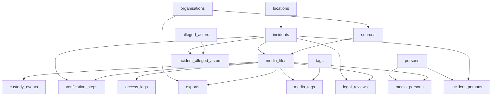
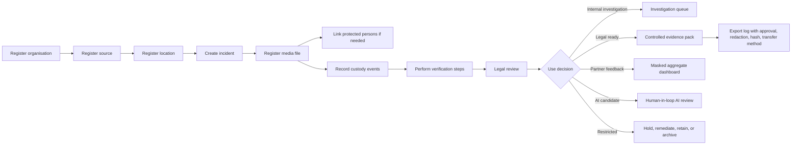

# Schema, Security, and Workflow Documentation

## Updated Schema

Primary schema files:

- `sql/schema.sql`: PostgreSQL DDL.
- `diagrams/videre_schema.dbml`: dbdiagram.io DBML.
- `diagrams/videre_schema_erd.mmd`: Mermaid ERD.

## Table Groups

### Primary Intake / Setup Tables

These tables can receive data directly during setup or evidence intake.

| Table | Data expected | Purpose |
| --- | --- | --- |
| `organisations` | CSO partners, legal recipients, vendors, internal programme units | Identifies organisations involved in collection, review, transfer, or export |
| `sources` | Pseudonymous source or partner submission records | Tracks source type, partner organisation, reliability, risk, and contact restriction |
| `persons` | Pseudonymous protected person records | Represents witnesses, victims, collectors, reviewers, visible persons, or subjects without direct PII |
| `locations` | Country, admin area, locality, coordinates, geolocation confidence | Provides geographic context and confidence level |
| `incidents` | Incident code, title, type, date/time, location, sensitivity, verification status | Core investigative case/event record |
| `alleged_actors` | Alleged actor names/types and notes | Tracks alleged actors separately from protected persons |
| `tags` | Controlled classification labels | Supports search, workflow, and thematic classification |
| `media_files` | Video/photo/audio/document registry, hash, storage URI, metadata, status | Main evidence item registry |

### Dependent / Workflow Tables

These depend on parent records.

| Table | Depends on | Purpose |
| --- | --- | --- |
| `incident_persons` | `incidents`, `persons` | Links protected persons to incidents by relationship type and confidence |
| `incident_alleged_actors` | `incidents`, `alleged_actors` | Links alleged actors to incidents |
| `media_persons` | `media_files`, `persons` | Links protected persons to media, including visibility and confidence |
| `custody_events` | `media_files` | Records collection, transfer, ingestion, review, export, archive, or deletion |
| `verification_steps` | `media_files`, `incidents` | Records geolocation, chronolocation, corroboration, duplicate, and technical checks |
| `legal_reviews` | `media_files`, `incidents` | Records legal readiness, restrictions, and evidentiary notes |
| `access_logs` | `media_files` | Records access and purpose for sensitive evidence |
| `exports` | `media_files`, `organisations` | Records controlled disclosure, approval, redaction, hash, and transfer method |
| `media_tags` | `media_files`, `tags` | Applies controlled tags to media |

## Dependency Chart

## Security Measures at Database Level

| Measure | Where implemented | Security value |
| --- | --- | --- |
| Primary keys | All entity tables | Stable identity and non-ambiguous records |
| Foreign keys | Relationship/workflow tables | Prevents orphaned custody, verification, export, or review records |
| Composite primary keys | Junction tables | Prevents duplicate relationship rows |
| Enums | Sensitivity, verification, custody, legal status | Restricts workflow states to controlled values |
| Check constraints | Reliability, confidence, geolocation confidence | Prevents invalid confidence/rating values |
| Hash fields | `media_files`, `custody_events`, `exports` | Preserves file, event, and export integrity |
| Sensitivity fields | Sources, persons, incidents, media, person relationships | Enables protection and access decisions |
| Retention category | `media_files` | Supports lawful retention, archive, and deletion workflows |
| Audit-style records | `access_logs`, `custody_events`, `exports`, `legal_reviews`, `verification_steps` | Makes actions traceable |
| Metadata preservation | `media_files.metadata_json` | Stores extracted metadata without overwriting original evidence |
| Pseudonymous persons | `persons`, `incident_persons`, `media_persons` | Supports analysis while avoiding direct identifying data exposure |

## Workflow

## Enforcement of Secure, Reliable, Investigative, Legal, and Ethical Standards

### Secure

- Sensitive data is classified at source, person, incident, media, and relationship level.
- Persons are pseudonymous; direct PII is not required in operational dashboards.
- Access and exports are logged.
- Export records require purpose, approval, redaction state, transfer method, and export hash.
- Media binaries are referenced by storage URI rather than stored directly in relational tables.

### Reliable

- Foreign keys enforce dependency integrity.
- Required fields ensure core evidence records contain minimum operational metadata.
- Controlled enums prevent uncontrolled workflow states.
- Indexes support operational search and dashboard refresh.
- OLTP and OLAP are separated so reporting does not interfere with evidence intake.

### Investigative

- Incidents, media, sources, locations, alleged actors, tags, and protected persons are cross-referenceable.
- Verification steps record method, result, reviewer, confidence, and notes.
- Confidence values prevent overclaiming.
- Custody gaps, missing metadata, duplicate evidence, and readiness gaps can be queried.

### Legal

- Legal status and legal review records are explicit.
- Chain of custody is modelled as a first-class workflow.
- Evidence exports are controlled and auditable.
- Evidence readiness can be derived from verification, custody, legal review, and export controls.

### Ethical

- Protected persons are modelled pseudonymously.
- Relationship-level protection allows a person to have different risk contexts across media/incidents.
- CSO partner views can be masked and aggregated.
- AI is positioned as triage support only, not as final verification or legal judgement.
- Restricted-use and do-not-use statuses prevent unsafe disclosure.

## Interview Statement

> The schema enforces standards by making unsafe or weak evidence visible. A file is not simply stored and assumed usable; it must have metadata, custody, verification, legal review, access classification, and export controls. This protects sources and affected people while giving investigators and legal teams a defensible trail from raw media to findings.

